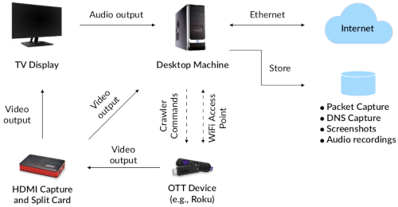

# Introduction
  This repository contains code and data for the ACM CCS'19 paper ["Watching You Watch: The Tracking Ecosystem of Over-the-Top TV Streaming Devices"](https://tv-watches-you.princeton.edu/tv-tracking-acm-ccs19.pdf)
  
  Find out more about our research on the paper's website: https://tv-watches-you.princeton.edu/
  
## Repo Structure
- scrape: Code for interacting with OTTs and capturing network traffic. See the [README](scrape/README.md) in [scrape](scrape) folder for instructions.
- src: Analysis code. See the [README](src/README.md) in [src](src).
- tls-fingerprints: TLS fingerprinting code. See the [README](tls-fingerprints/README.md) in [tls-fingerprints](tls-fingerprints) folder for instructions.


## Citation
You can use the following BibTeX entry to cite our paper:

```
@inproceedings{Mohajeri2019ott-tracking,
 author = {Mohajeri Moghaddam, Hooman and Acar, Gunes and Burgess, Ben and Mathur, Arunesh and Huang, Danny Yuxing and Feamster, Nick and Felten, Edward W. and Mittal, Prateek and Narayanan, Arvind},
 title = {Watching You Watch: The Tracking Ecosystem of Over-the-Top
TV Streaming Devices},
 booktitle = {Proceedings of the 2019 ACM SIGSAC Conference on Computer and Communications Security},
 series = {CCS '19},
 year = {2019},
 location = {London, UK},
 publisher = {ACM}
}
```
